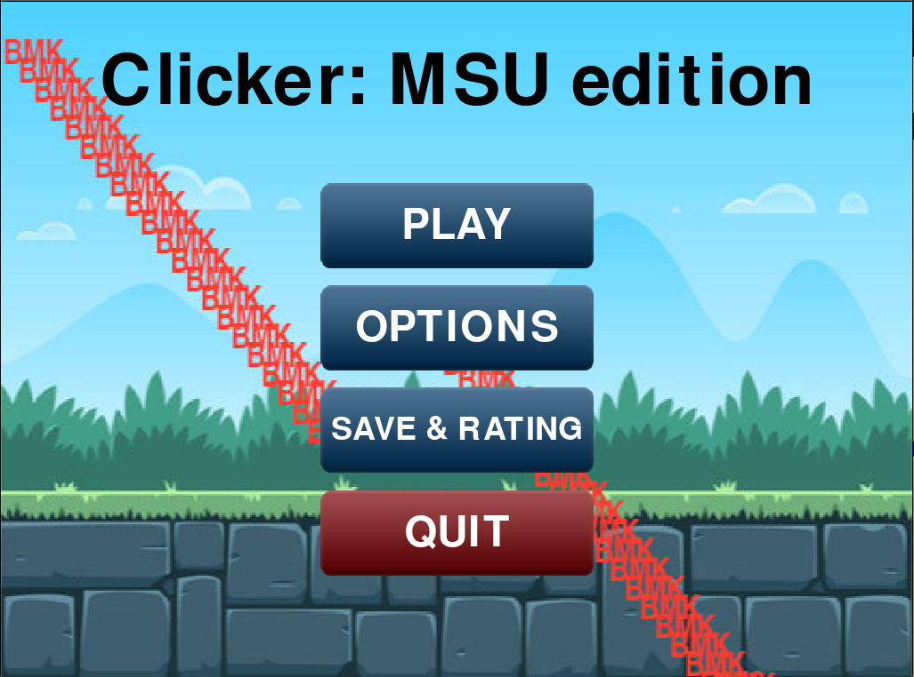
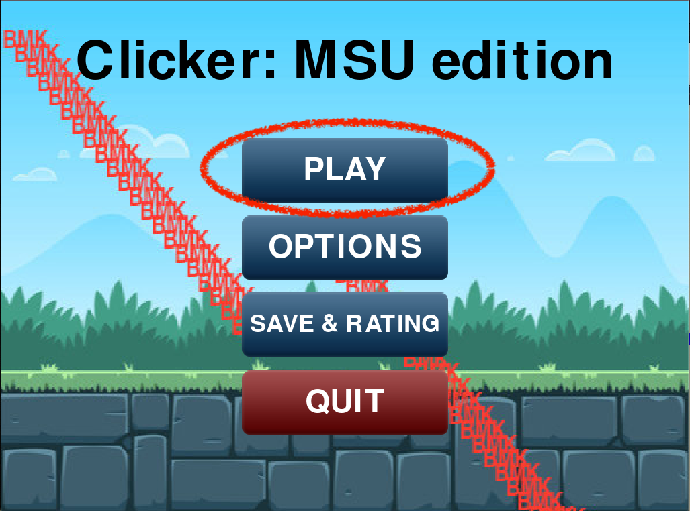
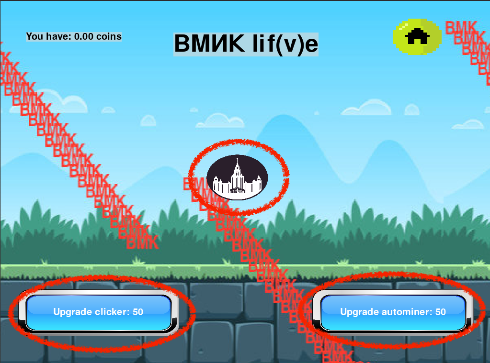
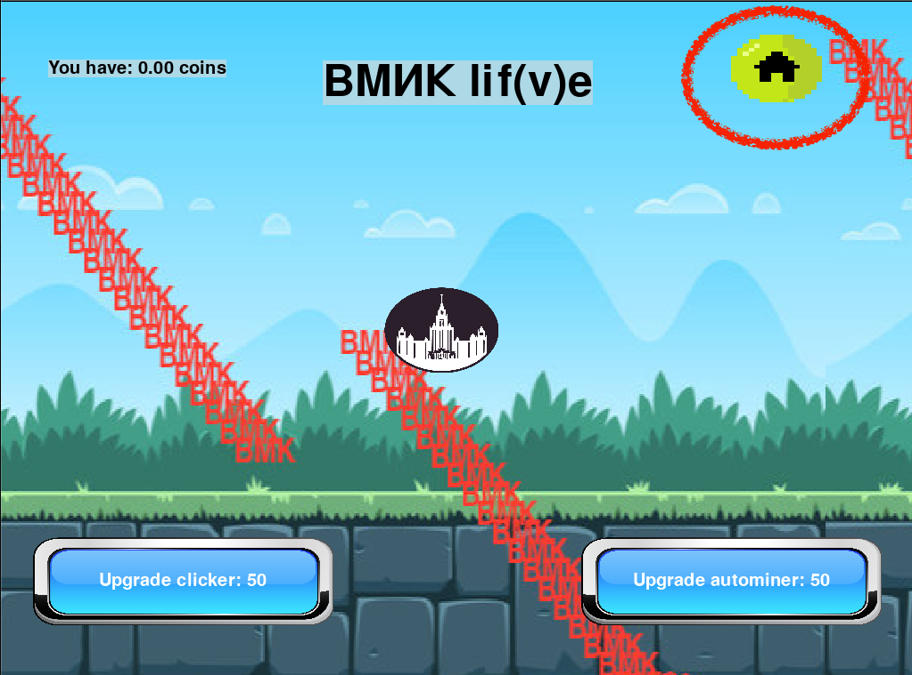
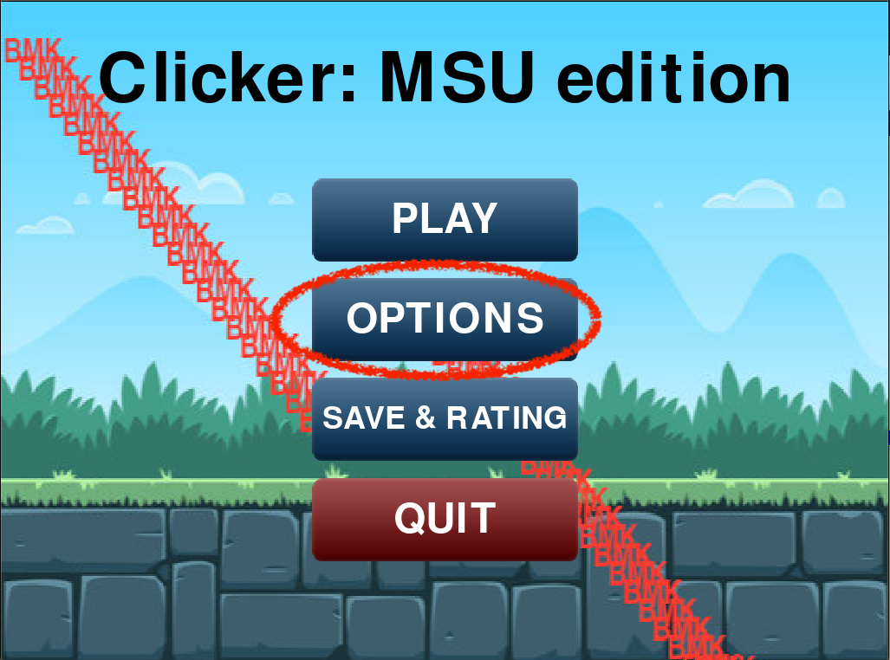
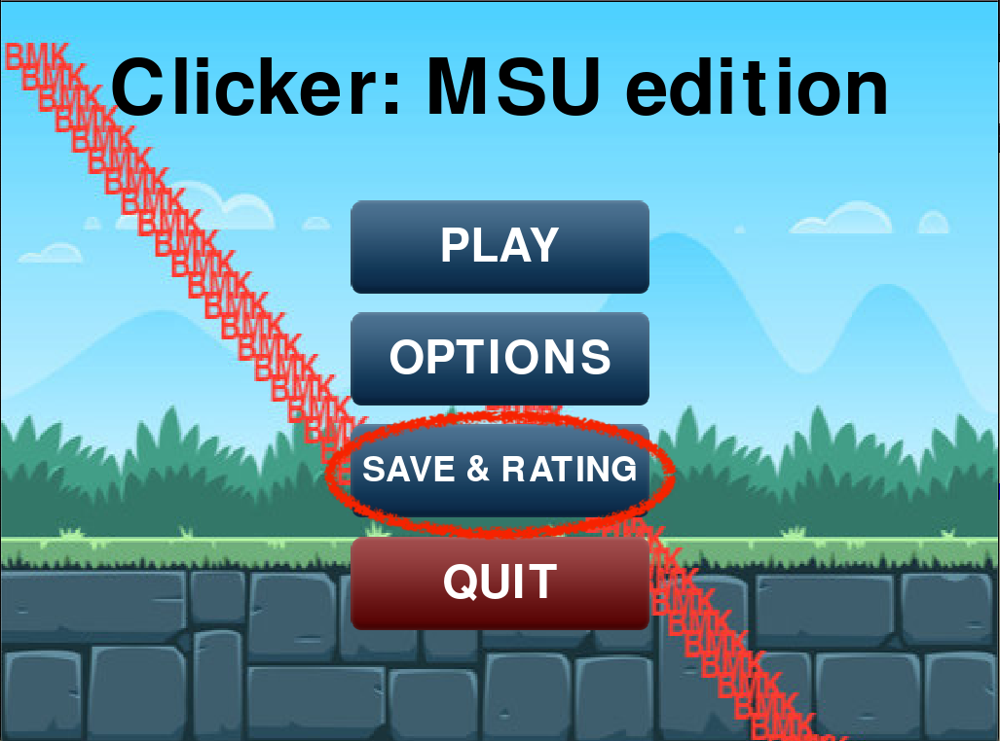
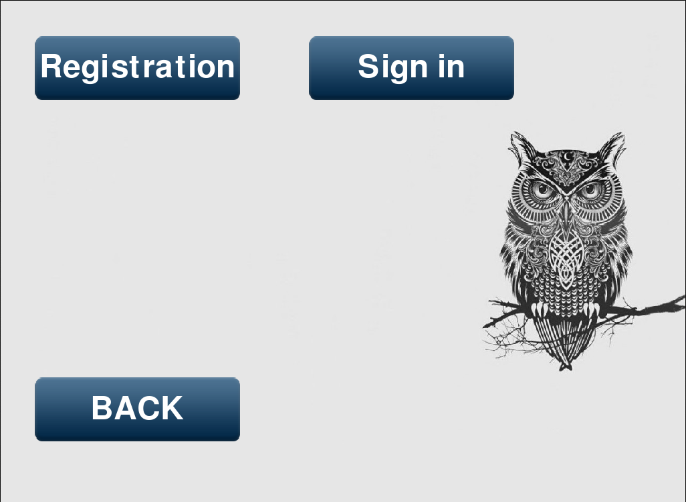

Game helper
===========

When you open the game next screen meets you:

.. _is_sweaty:

   Menu screen of game.

Press "PLAY" button to start the game:

   How to start playing.

After pressing on "PLAY" button you see next screen:

.. figure::  imgs/2.png
   :align:   center

   Game screen.

Press the button in the center to get more money, which you can spend on two boosters:

1. Upgrade autominer -- you will have automatic earning of coins. 
2. Upgrade clicker -- your next clicks will get you more money.

   Upgrades.

Touch button with house to go back to menu folder:

   Back menu button.

Touch optins button to go to options folder:

   Optins button.

There are some options:

.. figure::  imgs/4.png
   :align:   center

   Options.

Touch save&rating button to go to registration/signing folder, after which how can doscower game rating:

   Save&rating button.

   Registration menu.

Touch quit button to stop the game:

.. figure::  imgs/1copy4.png
   :align:   center

   Quit button.
